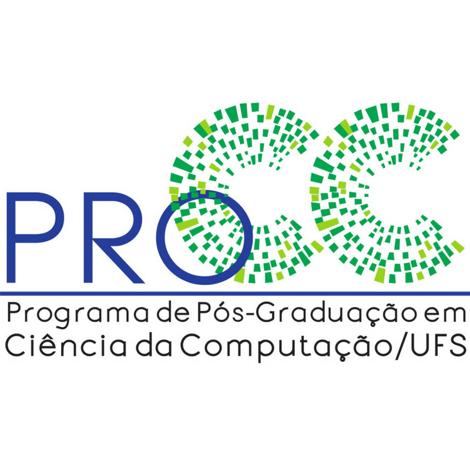

<p align="center">
  
  
</p>

<p align="center">
  
  
  
</p>

<p align="center">
  
    
  
</p>

# Mestrado RASE

Este código foi desenvolvido como parte do Mestrado do aluno Eike Natan Sousa Brito, no Programa de Pós-Graduação em Ciência da Computação (PROCC) da Fundação Universidade Federal de Sergipe (UFS), durante o período de 2024-2025.

O objetivo principal do projeto é a leitura e interpretação automatizada de normas de engenharia, convertendo um código RASE para o formato JSON. Para isso, utiliza-se o modelo LLaMA 3, explorando técnicas avançadas de Engenharia de Prompt, Fine-Tuning e Recuperação Aumentada por Geração (RAG). Esse processo visa aprimorar a compreensão e estruturação dos dados extraídos das normas, proporcionando maior precisão e eficiência na conversão para um formato estruturado e de fácil manipulação.

### Sistema Operacional

Deve funcionar conforme pretendido no **Windows**, **Linux** ou **macOS**.

### Interpretador Python

Atualmente requer Python **3.11.9**.

## Estrutura rapida

- `main.py`: menu principal para gerar e validar dados.
- `generates/menu_generate.py`: menu de selecao de N e modelos.
- `dataset.json`: entrada de textos.
- `predicts/`: saida gerada.

## Requisitos

- Python 3.11+.
- Ollama instalado e em execucao (`ollama serve`).
- Modelos serao baixados automaticamente pelo menu (quando necessario).

## Instalacao

```bash
python3 -m venv .venv
source .venv/bin/activate
python -m pip install -r requirements.txt
```

## Como iniciar

1. Garanta que o Ollama esteja rodando:

```bash
ollama serve
```

2. Inicie o menu principal:

```bash
python3 main.py
```

No menu, escolha "Gerar dados" e selecione o N (n1/n2/n3) e o modelo. O sistema usara `dataset.json` como entrada.

## Saidas

Os arquivos gerados ficam em `predicts/` no formato:

- `predicts/generate_<n>_<modelo>.json`

Exemplos:

- `predicts/generate_n1_mistral.json`
- `predicts/generate_n1_llama.json`

Cada arquivo contem um JSON com `counts`, `time` e `datas` (com o texto original e os textos gerados). Se nenhum N ou modelo for selecionado, o menu informa o que falta.

## Ajuda

Se você tiver dúvidas, relatórios de bugs ou solicitações de recursos, não hesite em nos mandar mensagem para o email **eike.sousa@hotmail.com**.

Lembre-se de seguir nosso **[Código de Conduta](https://github.com/EikESousA/IAnvisa/blob/main/CODE_OF_CONDUCT.md)**.

## Licença

Licenciado pelo CC0-1.0 license. Consulte o arquivo **[LICENSE](https://github.com/EikESousA/IAnvisa/blob/main/LICENSE)** para obter detalhes.
